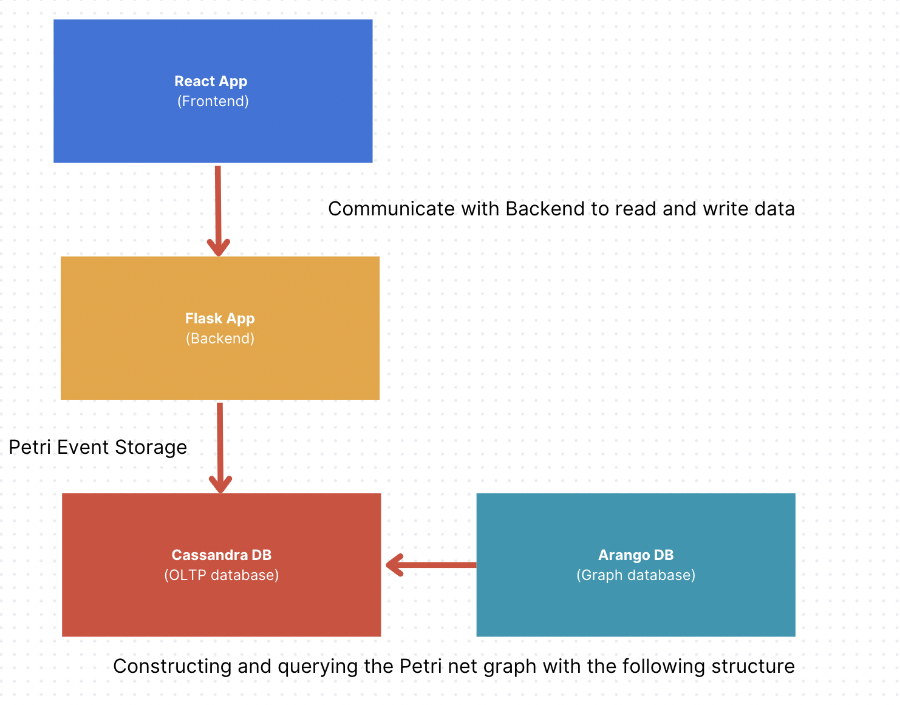

# Petri Net Implementation with Cassandra and ArangoDB

## Documentation update
- Rev. 1.0 <2023-09-28>

## Installation Requirements
- Docker & Docker Compose.

## Documentation

Please check the project documentation at [Petri.docx](./readme-reference/Petri.docx)

## Project Structure



## Deployment

```
git clone https://github.com/ZejunZhou/Petri-wekk1-demo.git

docker compose build

docker compose up
```

Access the frontend at http://localhost:3000

Access the Cassandra db at localhost:9042, (no web interface provided, but can use http://localhost:5001/get_event to get table result)

Access the Arango db at localhost:8529 default username: **root**, password: **123456**


